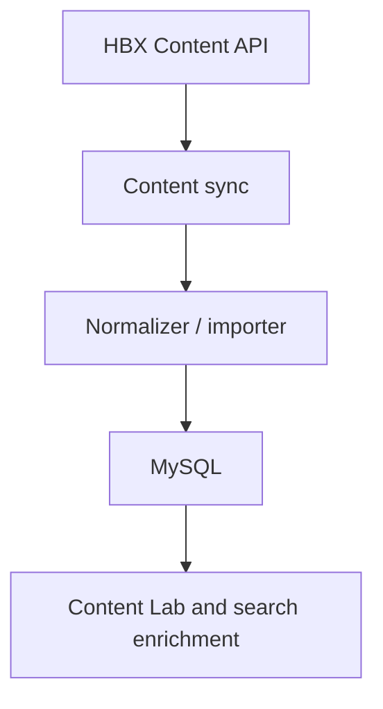
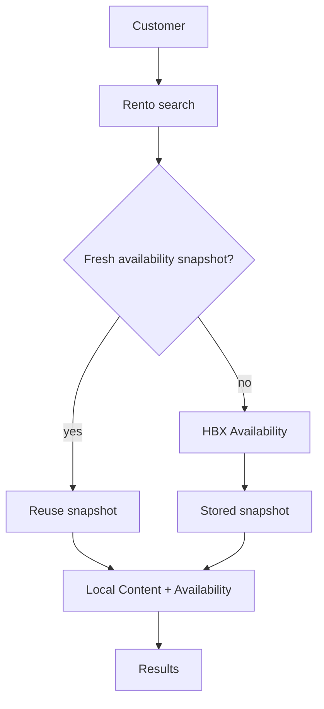
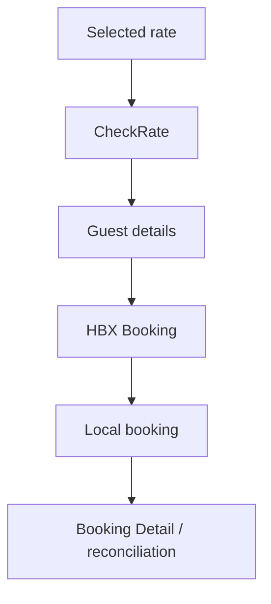
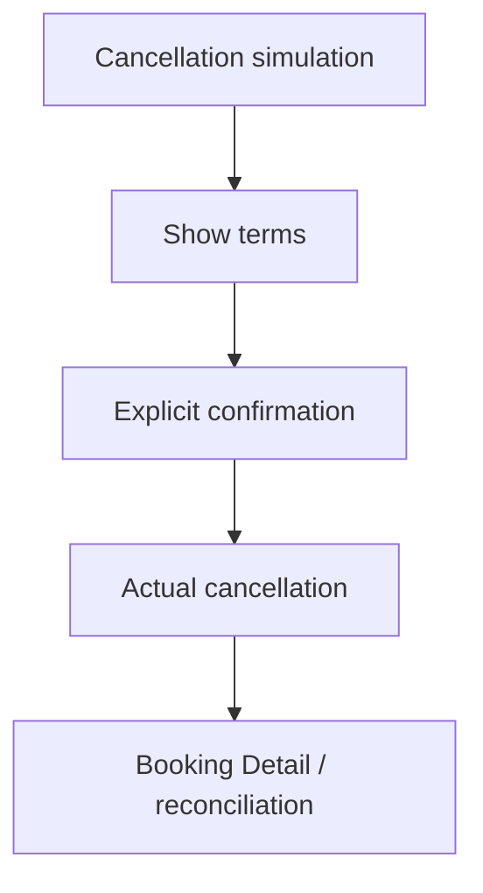
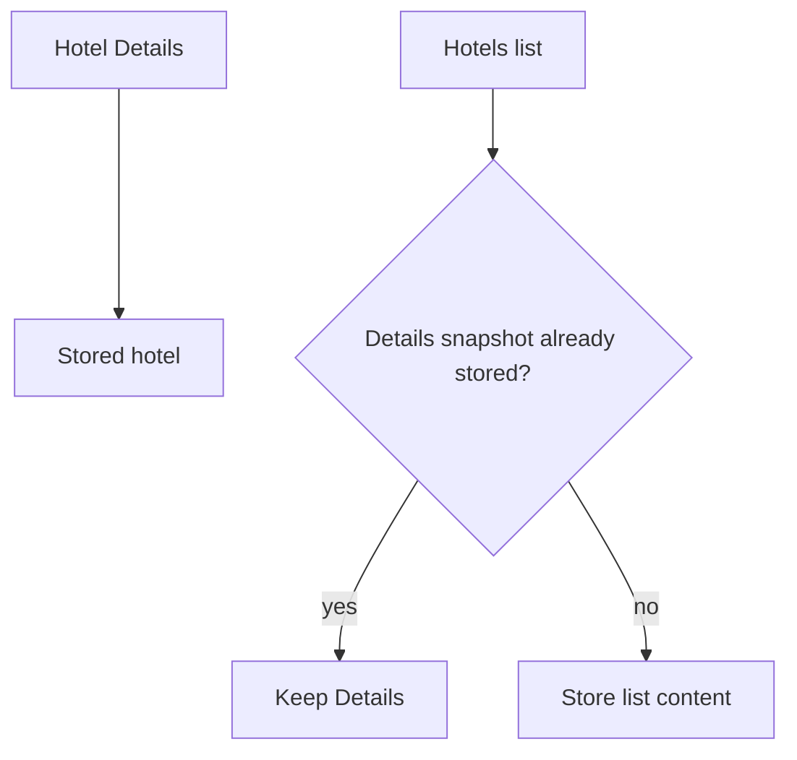

# HBX lab architecture

This repository is a supplier integration laboratory. It shows how Rento can synchronize HBX content, merge it with live availability, and complete a booking lifecycle. It is not the Rento Dubai production application.

## Content synchronization

```text
HBX Content API
    ↓
Content sync (one page at a time)
    ↓
Normalizer / importer
    ↓
MySQL normalized tables
    ↓
Content Lab and availability enrichment
```



Hotel list pages and Hotel Details use the same importer. A page is checkpointed only after every hotel on that page has been processed. A failed HTTP page does not advance `next_from`. Replaying a page is idempotent.

`--limit` is stored on the run as `requested_limit`. `fetched` is the cumulative total. Resume continues only until `requested_limit - fetched` reaches zero. That ceiling is separate from the page checkpoint. Omitting `--limit` stores no target, and that run stays unlimited. A run that already reached its target cannot be resumed. Runs created before this column have a null target, so they stay unlimited.

Reference catalogs use GET only. They upsert by supplier code. They do not use the hotel page checkpoint. Running the reference command again updates changed descriptions and leaves unchanged rows in place.

## Search

```text
Customer
    ↓
Rento search
    ↓
Availability cache?
    ├─ fresh fingerprint → reuse snapshot
    └─ stale or missing → HBX Availability
                          ↓
                    stored snapshot
                          ↓
              local Content + Availability
                          ↓
                       results
```



Content browsing reads MySQL only. Commercial availability stays on the existing live or cached HBX Availability path. The merge key is `hotelCode`. Room enrichment uses the exact `roomCode`.

A fresh snapshot is reused for the configured TTL, 60 seconds by default. An expired snapshot can still be inspected. It cannot be used to select or book a rate.

## Booking

```text
Selected rate
    ↓
CheckRate when required
    ↓
Guest details
    ↓
HBX Booking
    ↓
Local booking
    ↓
Booking Detail / reconciliation
```



The availability net is kept beside the CheckRate net. A difference is shown before booking. Booking, cancellation, and modification are not blindly retried. A timed-out booking is reconciled with the client reference, Booking List, and Booking Detail.

## Cancellation

```text
Cancellation simulation
    ↓
show penalty and terms
    ↓
explicit confirmation
    ↓
actual cancellation
    ↓
Booking Detail / reconciliation
```



Loading a booking page does not cancel it. Actual cancellation is a POST.

## Modification

Simulation is implemented. Actual execution is not. `executeModification()` throws `MODIFICATION_UNVERIFIED` and does not call HBX. The current supplier contract is not clear enough to guess a safe live modification.

## Content source precedence

```text
Hotel Details
    ↓
highest priority

Hotels list
    ↓
baseline

A later list import must not replace a Details snapshot.
```



When a list page would replace Details, the importer returns `hotel-details-retained`. The sync counts that as Details retained, not as a Conflict.
